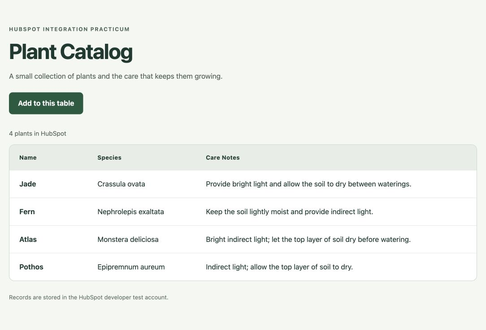

# HubSpot Plant Catalog

An Express application that reads and creates plant records in a HubSpot developer test account. It uses Axios for the HubSpot API and Pug for the homepage table and form.

**Status:** Submitted to HubSpot Academy on October 7, 2026 after completing the implementation, developer test account setup, private app creation, and live API validation. Manual grading is pending; certification requires a passing practicum grade. HubSpot states grading takes up to seven business days.

**Developer test account:** Fahmid Arman - Foundations Practicum (247627015), created specifically for this exercise.

**Developer test account object list:** [Plants in test account 247627015](https://app.hubspot.com/contacts/247627015/objects/2-269724890/views/all/list).

**Custom object:** Plants (`practicum_plants`), object type ID `2-269724890`. The object has the three custom string properties Name (`name`), Species (`species`), and Care Notes (`care_notes`), with the association type to contacts enabled.

## Run locally

Use Node.js 22 or later.

```sh
npm ci
cp .env.example .env
```

Edit the local `.env` file:

```dotenv
HUBSPOT_ACCESS_TOKEN=your_private_app_token
HUBSPOT_OBJECT_TYPE=your_custom_object_type_id
PORT=3000
```

```sh
npm start
```

Open http://localhost:3000. Click **Add to this table**, enter Name, Species, and Care Notes, then save. The application creates a HubSpot record and redirects to the homepage, which retrieves all pages of records with those three properties.

The server binds to the local computer only. Keep `.env` local and never commit, screenshot, or publish the access token. A reviewer should use their own test account token to run the application.

## HubSpot setup

1. Create a new developer test account with custom object access.
2. Create **Fahmid's Practicum Private App** in that test account with read and write access to custom object schemas, custom object records, and contacts, as prescribed by the course.
3. Submit `setup/plant-schema.json` to `POST /crm-object-schemas/v3/schemas`. The schema defines three custom string properties, including **Name**, and the association to contacts (`0-1`). Save the returned `objectTypeId` in `.env`.
4. Submit `setup/seed-plants.json` to `POST /crm/v3/objects/{objectTypeId}/batch/create` once to create the three initial records. Check existing records before retrying a failed request to avoid duplicates.
5. Replace the pending account link above with `https://app.hubspot.com/contacts/{test-account-id}/objects/{objectTypeId}/views/all/list`.
6. Verify a fourth record can be created through the browser form and appears in the live HubSpot table.

Setup JSON contains sample data only. The app sends tokens only in the Authorization header to `https://api.hubapi.com`.

## Routes and views

| Route | Behavior | View |
| --- | --- | --- |
| `GET /` | Reads all plant records, requesting all three properties | `views/homepage.pug` |
| `GET /update-cobj` | Displays the three-field creation form | `views/updates.pug` |
| `POST /update-cobj` | Validates and creates a record, then redirects to `/` | Re-renders the form on failure |

The form uses the required title **Update Custom Object Form | Integrating With HubSpot I Practicum** and includes **Return to the homepage**. Errors preserve entered values, and CRM text is HTML-escaped by Pug.

## Validation

```sh
npm test
npm audit --omit=dev
```

Six automated tests pass and exercise pagination, successful form creation and subsequent listing, missing/oversized/repeated fields, the prescribed form controls, API failures, and cross-origin submission rejection. The dependency audit reports zero vulnerabilities.

A separate live browser check on October 7, 2026 retrieved the three initial records (Atlas, Fern, and Jade) from HubSpot. Submitting Pothos through `/update-cobj` created a fourth record, redirected to `/`, and displayed the record in the table. The schema API also confirmed all three custom properties and the contacts association.



## Development assistance

This implementation was prepared with OpenAI Codex assistance at Fahmid Arman's request. Commits record actual development steps and include Codex as a co-author; they do not represent unaided work. HubSpot's requirement that all work be the learner's own must be considered during review. No certification approval is claimed.

## References

- [HubSpot Academy starter repository](https://github.com/HubSpot-Academy/integrating-with-hubspot-i-foundations-practicum)
- [HubSpot schemas API guide](https://developers.hubspot.com/docs/api-reference/legacy/crm/objects/schemas/guide)
- [HubSpot custom object records API guide](https://developers.hubspot.com/docs/api-reference/legacy/crm/objects/custom-objects/guide)
